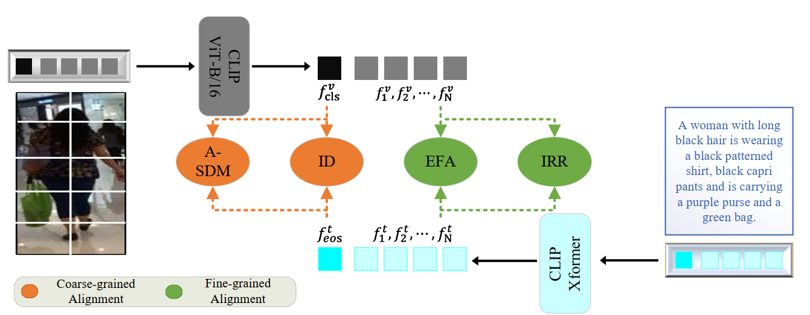

# Cross-modal Full-mode Fine-grained Alignment for Text-to-Image Person Retrieval

Official PyTorch implementation of the paper Cross-modal Full-mode Fine-grained Alignment for Text-to-Image Person Retrieval ([ACM TOMM](https://dl.acm.org/doi/10.1145/3786798)) [Arxiv](https://arxiv.org/abs/2509.13754).



## Requirements and Datasets
Same as [IRRA](https://github.com/anosorae/IRRA)

## Usage
### Requirements
we use single Nvidia A6000 48G GPU for training and evaluation. 
```
pytorch 1.9.0
torchvision 0.10.0
prettytable
easydict
```

### Prepare Datasets
Download the CUHK-PEDES dataset from [here](https://github.com/ShuangLI59/Person-Search-with-Natural-Language-Description), ICFG-PEDES dataset from [here](https://github.com/zifyloo/SSAN) and RSTPReid dataset form [here](https://github.com/NjtechCVLab/RSTPReid-Dataset)

Organize them in `your dataset root dir` folder as follows:
```
|-- your dataset root dir/
|   |-- <CUHK-PEDES>/
|       |-- imgs
|            |-- cam_a
|            |-- cam_b
|            |-- ...
|       |-- reid_raw.json
|
|   |-- <ICFG-PEDES>/
|       |-- imgs
|            |-- test
|            |-- train 
|       |-- ICFG_PEDES.json
|
|   |-- <RSTPReid>/
|       |-- imgs
|       |-- data_captions.json
```

### Prepart Pre-train Model Checkpoint
Download the pre-train model checkpoints from [NAM](https://github.com/WentaoTan/MLLM4Text-ReID) and [HAM](https://github.com/sssaury/HAM).

## Training

To train the model with the backbone without pretrained in the Re-ID domain, you can run the [run.sh](run.sh). 

To train the model with the backbone with pretrained in the Re-ID domain, you can run the [finetune.sh](finetune.sh). 

## Testing

```python
python test.py --config_file 'path/to/model_dir/configs.yaml'
```

## Acknowledgments

This repo borrows partially from [IRRA](https://github.com/anosorae/IRRA), [NAM](https://github.com/WentaoTan/MLLM4Text-ReID) and [HAM](https://github.com/sssaury/HAM).


## Citation
If you find our work useful, please cite it as follows:
```bibtex
@article{yin_2026_fmfa,
author = {Yin, Hao and Man, Xin and Chen, Feiyu and Shao, Jie and Shen, Heng Tao},
title = {Cross-modal Full-mode Fine-grained Alignment for Text-to-Image Person Retrieval},
year = {2026},
publisher = {Association for Computing Machinery},
address = {New York, NY, USA},
issn = {1551-6857},
url = {https://doi.org/10.1145/3786798},
doi = {10.1145/3786798},
note = {Just Accepted},
journal = {ACM Trans. Multimedia Comput. Commun. Appl.},
month = jan,
}
```

